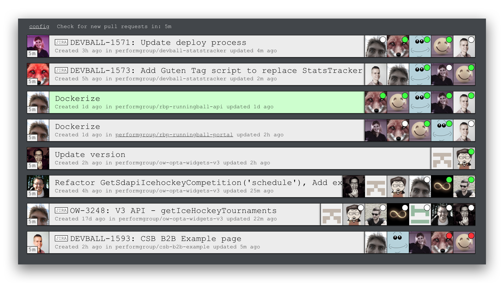

Pull request monitor (AKA ProMonitor)
===



ProMonitor is a simple tool that displays open Pull Requests from defined gitshit repositories.  It's main goal is to display reviewers status along with other basic informations like time from last update, author, repository etc.

First steps
---

Open live version of promonitor: [devballteam.github.io/promonitor](https://devballteam.github.io/promonitor).  You will be redirected to config page.  Now you have to create config JSON.  Instruction and example is provided on config page.  Another example can be found below.

Config JSON
---

Config is stored in your `localStorage`.

### Example:

```JSON
{
  "token": "your_github_token",
  "refreshTime": 300000,
  "defaultBranch": "develop",
  "ticketsUrl": "https://jira.your_company_domain.com/browse/",
  "reminder": {
    "hours": ["9:30", "11:00", "14:00"],
    "duration": 1800000,
    "message": "The time has come to check Pull Requests!"
  },
  "repos": [
    {"fullName": "mateuszgachowski/Carpet.js"},
    {"fullName": "zeit/hyper-site", "defaultBranch": "master", "refreshTime": 1200000},
    {"fullName": "devballteam/promonitor", "defaultBranch": "master"}
  ]
}
```

### Values:

- `token`: GitHub token.  You can create one in your settings [page](https://github.com/settings/tokens).  During creation of token enable `repo` in scope section.  If you like to display PR from private repositories you will have to authenticate by clicking on `sso` button after token is created.
- `refreshTime`: Time in milliseconds to next refresh.  On each main refrest list of PR is updated.  If new PR appear then it will be added to list.  From now PR is refreshed independent from main list.  Time to next refresh is displayed on top of the page (for PR list) and in left bottom corner of each PR.
- `defaultBranch`: It's name of branch PR is aiming to mere.  If someone accidental create PR with different target then you will see red warning in top left corner with branch name.
- `ticketsUrl`: Link to your issue tracker.  To make it work you have to begin your PR with ticket ID like: `PROJECTNAME-NUMBER` or `TEAMNAME NUMBER` (so its text and number separated with space or dash).
- `reminder`: By defining this object You enable reminder feature.  It will remind Your team on specified hours that they should look at Pull Requests.  Reminder is displayed as clearly visible red border around whole screen with message at the bottom.
- `reminder.hours`: **Optional** Array with hours in string format.  By default its ["11:00", "14:00"].
- `reminder.duration`: **Optional** How long reminder message should be visible.  Value in milliseconds. Default is 30 min.
- `reminder.message`: **Optional** Your reminder message.  Default value is: "It's time to review Pull Requests.".
- `repos`: List of repositories you like to monitor.
- `repos[].fullName`: Name of repository.
- `repos[].defaultBranch`: **Optional** You can specify different default branch for each repository if you like to have it different then main `defaultBranch`.
- `repos[].refreshTime`: **Optional** You can specify different refresh time for each repository if you like to have it different then main `refreshTime`.

Features
---

### Tool features:

- **Refresh timer**
- **Config page**

### Pull Request informations:

- **Pull Request name as link**
- **Author avatar**
- **Refresh time**
- **Wrong branch warning** - Appear only if PR is targeted to different branch then defined in config JSON.
- **Time from creation of PR**
- **Name as link of PR repository**
- **Time since last update**
- **List of reviewers**
- **Reviewer review status**
  - Reviewer starts with no review indicator.
  - Orange dot mean that he left some comments or he is working on his review.
  - Red dot means he requires changes.
  - Green dot means that he approved PR.
  - White dot means that reviewer left some review earlier but during that time new commit was added so reviewer need to review PR again.
- **Ready status** - When all reviewers will have 'approved' status then whole PR is highlighted with green background.
- **Ticket link** - If PR name begins with issue tracker (like JIRA) ticket then additional button will appear before PR link.
